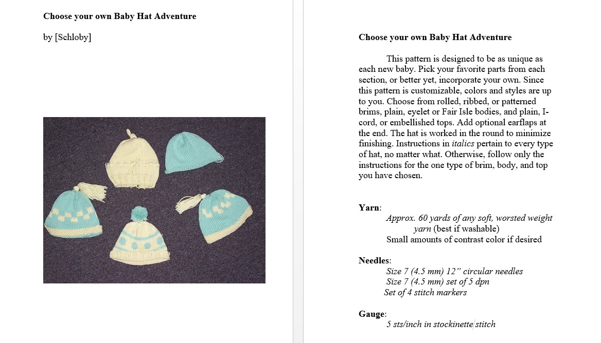
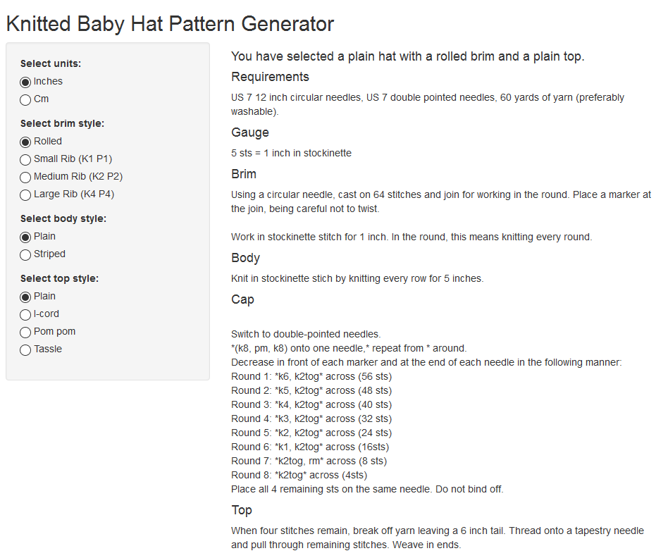

Knitted Baby Hat Pattern Generator
========================================================
author: Schloby 
date: July 2016
autosize: true


Introduction
========================================================

As an avid knitter, I frequently make baby hats for friends and charity. The pattern is broadly the same for each one, but the individual components can be changed to create very different final products. 

This app is based on a previous pattern that I wrote as 'Choose Your Own Adventure' style pamphlet and sold in my local yarn shop. That pattern involved 'If you would like this, turn to page 5...' style instructions, so it seemed a natural fit for an interactive app. 

This app provides fewer options than the original pattern did at the moment, but there is room for future improvements.



The app itself (with supporting documentation) is located on the free Shiny server [here](http://schloby.shinyapps.io/Hat_Generator/).


The App
========================================================


### Input
The app uses four sets of radio buttons to select the type of pattern. One toggles between English and metric measurements, the other three allow the brim style, the body style, and the top decoration style to be set by the user. 

### Operation
The server.R returns reactive text based on the user inputs. This is largely a series of if statements, but it also toggles the measurements between English and metric. 

### Reactive outputs
The reactive text is changed by switching the radio buttons. It returns a newly generated pattern based on user selections. As it is only small amounts of text, this is done instantly, and doesn't require the user to press a button before refreshing. 


### Documentation
Documentation is available at the Shiny website. The app itself should be easy enough for anyone to use by toggling the radio buttons, but the resulting pattern is probably for an advanced beginner knitter. 

***



Code Example
========================================================

For example, the code inside server.R for the brim selection is as follows:


```r
#Do the brim 

        x<-if (input$units=="inches") {"1 inch."}
            else if (input$units =="cm") {"2.5 cm."}
        
        
        if (input$brim=="rolled") {
            paste("Work in stockinette stitch for", x, "In the round, this means knitting every round.")
            
            
        } else if (input$brim=="small ribbed"){
            paste("On the next round *K1, P1*, repeat until end. Repeat this round this for", x)
            
        }else if (input$brim=="medium ribbed"){
            paste("On the next round *K2, P2*, repeat until end. Repeat this round this for", x)
        }
        
        else if (input$brim=="large ribbed"){
            paste("On the next round *K4, P4*, repeat until end. Repeat this round this for", x)
            
        }
```

If we run this with the options of a rolled brim with units in cm, we get:


```
[1] "Work in stockinette stitch for 2.5 cm. In the round, this means knitting every round."
```

And if we run this for a medium ribbed brim with units in inches, we get:

```
[1] "On the next round *K2, P2*, repeat until end. Repeat this round this for 1 inch."
```


A similar reactive text occurs for each type of brim, body, and top style. 

Future Improvements
========================================================
Future versions of this app could be extended to include the following improvements:

### Mutliple sizes

Add radio buttons for extended sizes, ranging from toddler to adult. 
    
### Interactive sketch

A sketch of the hat with the chosen components could also update based on the radio buttons. 
    

### Brim options

Different stitch patterns, such as garter or moss stitch.


### Body options

Fair Isle patterns (the kind that look like ski sweaters).

Eyelet row (so a ribbon can be threaded through). 

Lace rows or patterns.

### Other decorations

Other embellishments such as ear flaps.


